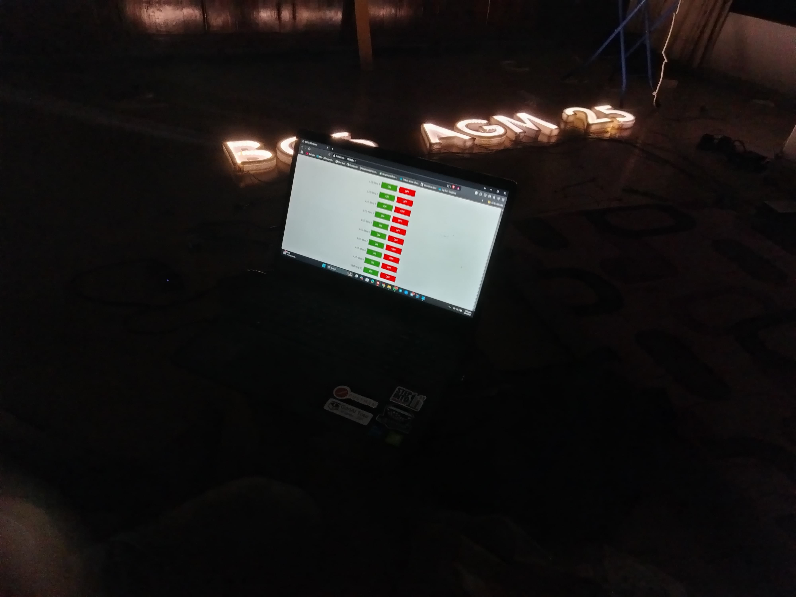
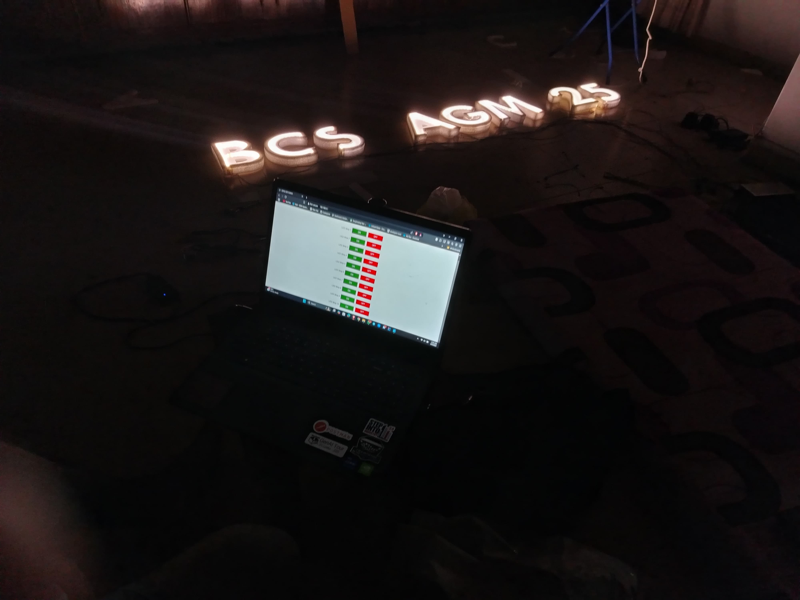
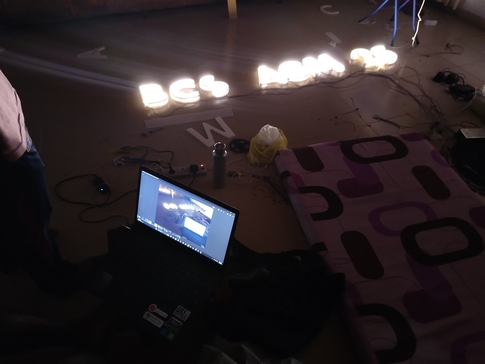

# ESP32 QR Code Lighting Control System

A WiFi-enabled relay control system using ESP32 that allows you to control up to 8 relays (lights/devices) via a web interface or QR codes.

## 📋 Features

- **WiFi Access Point**: Creates its own WiFi network (ESP32-RELAY)
- **Web Control Panel**: Clean, dark-themed web interface for manual control
- **QR Code Integration**: Control individual relays by scanning QR codes
- **8 Channel Control**: Support for up to 8 independent relay channels
- **Real-time Response**: Instant ON/OFF control via HTTP requests
- **Mobile Friendly**: Responsive design works on phones and tablets

## 🛠️ Hardware Requirements

- ESP32 Development Board
- 8-Channel Relay Module (or fewer based on your needs)
- Power Supply (5V for relays, appropriate voltage for your devices)
- Jumper Wires
- LED Strips or other devices to control

## 📸 Project Photos

### LED Strip Setup







## 🔌 Pin Configuration

The default GPIO pins for the 8 relays are:

| Relay | Label | GPIO Pin |
|-------|-------|----------|
| 1     | B     | 13       |
| 2     | C     | 12       |
| 3     | S     | 14       |
| 4     | A     | 27       |
| 5     | G     | 26       |
| 6     | M     | 25       |
| 7     | 2     | 33       |
| 8     | 5     | 32       |

**Note**: You can modify these pins in the code by editing line 11:
```cpp
int relayPins[8] = {13, 12, 14, 27, 26, 25, 33, 32};
```

## 📡 WiFi Configuration

- **SSID**: ESP32-RELAY
- **Password**: 12345678
- **IP Address**: 192.168.4.1 (default for ESP32 AP mode)

You can change these credentials in lines 7-8 of the code.

## 🚀 Installation & Setup

### 1. Install Arduino IDE
- Download and install [Arduino IDE](https://www.arduino.cc/en/software)

### 2. Install ESP32 Board Support
1. Open Arduino IDE
2. Go to **File > Preferences**
3. Add this URL to "Additional Board Manager URLs":
   ```
   https://raw.githubusercontent.com/espressif/arduino-esp32/gh-pages/package_esp32_index.json
   ```
4. Go to **Tools > Board > Boards Manager**
5. Search for "ESP32" and install "esp32 by Espressif Systems"

### 3. Install Required Libraries
1. Go to **Sketch > Include Library > Manage Libraries**
2. The following libraries should be included with ESP32 board package:
   - WiFi
   - WebServer

### 4. Upload the Code
1. Open `lightingsytemqr.ino` in Arduino IDE
2. Select your ESP32 board: **Tools > Board > ESP32 Dev Module**
3. Select the correct COM port: **Tools > Port**
4. Click **Upload** button

### 5. Connect Hardware
- Connect each relay's control pin to the corresponding ESP32 GPIO pin
- Connect relay VCC to 5V power supply
- Connect relay GND to common ground with ESP32
- Connect your LED strips or devices to the relay outputs

## 💡 Usage

### Web Interface Control

1. Connect to WiFi network "ESP32-RELAY" (password: 12345678)
2. Open a web browser and navigate to: `http://192.168.4.1`
3. You'll see a control panel with ON/OFF buttons for each relay
4. Click buttons to control individual relays

### QR Code Control

You can create QR codes that link to these URLs for quick control:

| Relay | QR Code URL |
|-------|-------------|
| B (1) | `http://192.168.4.1/B` |
| C (2) | `http://192.168.4.1/C` |
| S (3) | `http://192.168.4.1/S` |
| A (4) | `http://192.168.4.1/A` |
| G (5) | `http://192.168.4.1/G` |
| M (6) | `http://192.168.4.1/M` |
| 2 (7) | `http://192.168.4.1/2` |
| 5 (8) | `http://192.168.4.1/5` |

**How to use QR codes:**
1. Generate QR codes using any QR code generator (e.g., [qr-code-generator.com](https://www.qr-code-generator.com/))
2. Use the URLs above as the QR code content
3. Print and place QR codes near the devices you want to control
4. Scan with your phone (connected to ESP32-RELAY WiFi) to turn on that relay

## 🔧 Customization

### Change Relay Labels
Edit line 32 in the code:
```cpp
const char* labels[8] = {"B","C","S","A","G","M","2","5"};
```

### Change WiFi Credentials
Edit lines 7-8:
```cpp
const char* ssid = "YOUR_SSID";
const char* password = "YOUR_PASSWORD";
```

### Modify Web Interface Colors
Edit the CSS section (lines 20-26) to customize the look:
```css
body { background:#0e0e0e; color:white; }
.on { background:green; color:white; }
.off { background:red; color:white; }
```

## 🔍 Troubleshooting

### Can't connect to WiFi
- Make sure you're connecting to "ESP32-RELAY" network
- Check that the password is correct: "12345678"
- Verify ESP32 is powered on and code is uploaded

### Relays not responding
- Check your wiring connections
- Verify the GPIO pins match your hardware setup
- Some relay modules are active-LOW (current setup) or active-HIGH (swap HIGH/LOW in code)

### Can't access web page
- Ensure you're connected to the ESP32's WiFi network
- Try the IP address shown in Serial Monitor
- Clear your browser cache

### Serial Monitor shows errors
- Check baud rate is set to 115200
- Verify ESP32 board is properly selected
- Try pressing the RESET button on ESP32

## 📝 API Endpoints

| Endpoint | Method | Description |
|----------|--------|-------------|
| `/` | GET | Main control panel |
| `/relay/{id}/on` | GET | Turn on relay (id: 0-7) |
| `/relay/{id}/off` | GET | Turn off relay (id: 0-7) |
| `/B` | GET | Turn on Relay 1 (B) |
| `/C` | GET | Turn on Relay 2 (C) |
| `/S` | GET | Turn on Relay 3 (S) |
| `/A` | GET | Turn on Relay 4 (A) |
| `/G` | GET | Turn on Relay 5 (G) |
| `/M` | GET | Turn on Relay 6 (M) |
| `/2` | GET | Turn on Relay 7 (2) |
| `/5` | GET | Turn on Relay 8 (5) |

## 🔐 Security Notes

- This system creates an open access point for local control
- Change the default password for better security
- Not recommended for internet-facing applications without proper authentication
- For production use, consider adding:
  - HTTPS support
  - User authentication
  - Access control lists

## 📄 License

This project is open source and available for personal and educational use.

## 🤝 Contributing

Feel free to fork this project and submit pull requests for improvements!

## ⚡ Future Enhancements

- [ ] Add authentication system
- [ ] Implement timer/scheduling functionality
- [ ] Add relay status indicators on web interface
- [ ] Support for MQTT integration
- [ ] Mobile app development
- [ ] Voice control integration (Alexa/Google Home)

## 📞 Support

If you encounter any issues or have questions, please check the troubleshooting section or refer to the ESP32 documentation.

---

**Made with ❤️ for smart home automation**

